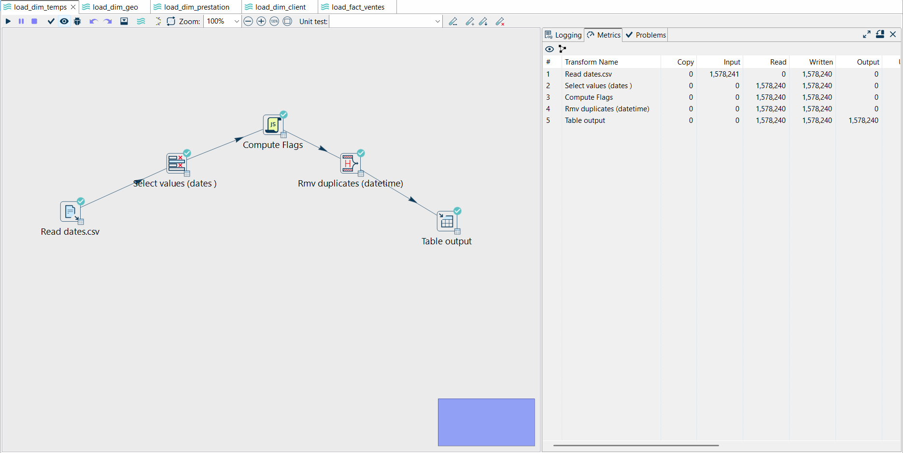
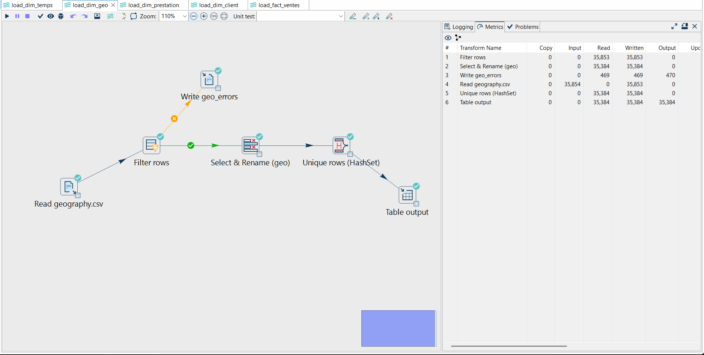
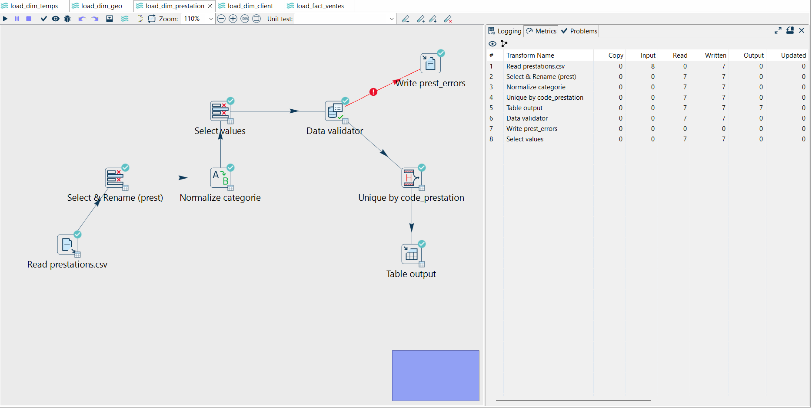
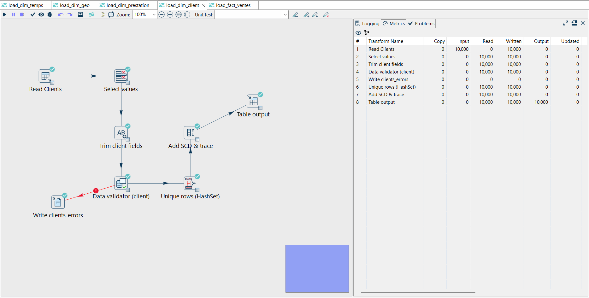
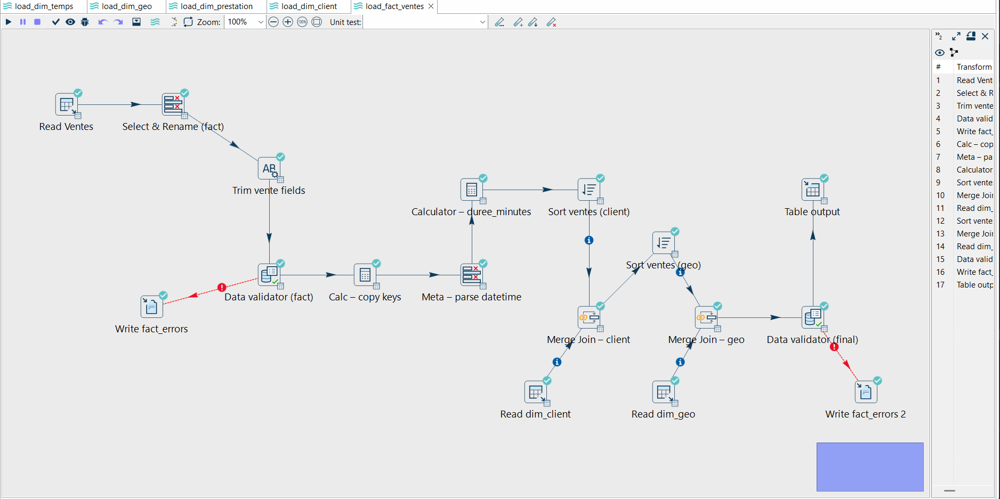

# Projet ETL – Data Warehouse (Apache Hop + SQLite)

---

##  Contenu du dépôt

Ce dépôt contient l’ensemble du projet ETL (Extraction, Transformation, Loading) et Data Warehouse réalisé sous **Apache Hop** avec base **SQLite**.

### Structure du projet

```
etl-datawarehouse/
├─ hop/                       
│  ├─ load_dim_client.hpl
│  ├─ load_dim_geo.hpl
│  ├─ load_dim_prestation.hpl
│  ├─ load_dim_temps.hpl
│  ├─ load_fact_ventes.hpl
│  ├─ metadata/
│  └─ project-config.json
├─ sql/
│  └─ create_dw.sql          
├─ data/
│  ├─ sample/                
│  │  ├─ dates_sample.csv
│  │  ├─ geography_sample.csv
│  │  └─ prestations_sample.csv
│  └─ README.md              # d’où viennent les données complètes 
├─ env/
│  └─ tp_env_etl.example.json 
│    
├─ docs/
│  ├─ Modélisation.pdf             # schéma étoile
│  └─ screenshots/           # captures
├─ outputs/                  # ignoré (résultats/erreurs)
├─ .gitignore
├─ LICENSE
└─ README.md
```

---

##  Description du projet

Ce projet implémente un **mini Data Warehouse** alimenté via des pipelines **Apache Hop**.  
L’objectif est de construire un schéma en **étoile** à partir de données brutes opérationnelles et de les charger dans une base SQLite.

Le projet comprend :
- la **modélisation dimensionnelle** du data warehouse (modèle en étoile)  
- la **création du schéma SQL** (`create_dw.sql`)  
- la **configuration des connexions** dans Apache Hop  
- et la **construction de 5 pipelines ETL** pour alimenter les tables de dimensions et la table de faits.

---

**Connexions Hop :**
- `OP_SQLite` → base opérationnelle (`operational_data.db`)
- `DW_SQLite` → entrepôt de données (`dw_etl_combo.db`)

---


> Chaque pipeline se base sur les variables d’environnement définies dans Hop.  
> Les sorties d’erreurs sont exportées dans le dossier `OUTPUTS/`.


---


---

## 📊 Pipelines ETL – Visualisation

| Étape | Capture | Description |
|-------|----------|-------------|
| Dimension Temps |  | Construction de la dimension temporelle |
| Dimension Géographique |  | Nettoyage et chargement des données géographiques |
| Dimension Prestations |  | Normalisation et validation des prestations |
| Dimension Clients |  | Validation, nettoyage et historisation SCD |
| Faits Ventes |  | Intégration finale avec jointures et calculs dérivés |

---

